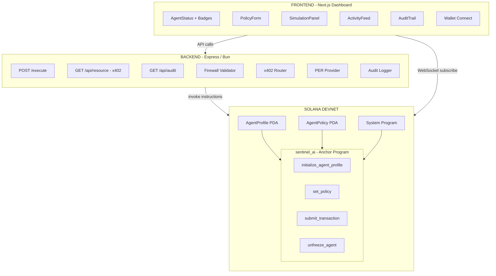

<p align="center">
  
  
  
  
  
</p>

<h1 align="center">🛡️ SentinelAI</h1>

<p align="center">
  <b>The Firewall for the Agentic Economy — On-Chain Execution Control for Autonomous AI Agents on Solana</b>
</p>

<p align="center">
  <i>"SentinelAI is like a corporate expense policy for AI agents — enforced on-chain, impossible to bypass, with automatic shutdown when agents go rogue."</i>
</p>

---

## 🚀 What is SentinelAI?

AI agents are getting wallets, managing treasuries, and making autonomous financial decisions on Solana. But there are **zero guardrails**. A rogue agent can drain a wallet in milliseconds, and there's no kill switch fast enough for 400ms finality.

**SentinelAI** is an on-chain **Execution Control Layer** that intercepts every AI agent transaction and enforces safety — at the speed of Solana.

Every transaction goes through a multi-stage firewall:

```
Agent Transaction → Frozen Check → Reputation Decay → Reputation Gate → Policy Check → Tiered Threshold → ✅ Execute or ❌ Reject
```

If an agent goes rogue, the **Circuit Breaker** auto-freezes it on-chain after 3 consecutive failures — no human intervention required.

---

## ✨ Key Features

| Feature | Description |
|:--------|:------------|
| 🛡️ **On-Chain Circuit Breaker** | Auto-freezes agents after 3 consecutive failures — the only on-chain kill switch for AI agents |
| 📊 **Real-Time Dashboard** | Live WebSocket streaming of on-chain events, reputation changes, and transaction outcomes |
| 💸 **x402 HTTP Payments** | Full HTTP 402 challenge-response protocol for machine-to-machine agent commerce |
| ⏳ **Reputation Decay** | Idle agents lose reputation over time — scores reflect current reliability, not history |
| 📜 **Immutable Audit Trail** | SHA-256 hashed audit logs with privacy-preserving redaction for sensitive operations |
| 🔒 **Private Execution (MagicBlock PER)** | Route sensitive transactions through MagicBlock's Ephemeral Rollups for transaction opacity |
| 🏅 **Dynamic Badges** | Behavioral scoring chips (Reliable Executor, Privacy Pioneer, Whale Operator, etc.) |
| ⚡ **Multi-Factor Policies** | Tiered transaction limits — high-value transfers require higher reputation thresholds |

---

## 🏗️ Architecture



---

## 🛠️ Tech Stack

| Layer | Technology |
|:------|:-----------|
| **Smart Contract** | Rust, Anchor 0.30, Solana (Devnet) |
| **Backend API** | TypeScript, Express, Bun runtime |
| **Frontend** | Next.js 15, Tailwind CSS, `@solana/wallet-adapter` |
| **Privacy** | MagicBlock Ephemeral Rollups (PER) |
| **Payments** | x402 HTTP 402 Protocol |
| **Audit** | SHA-256 hashed JSONL append-only logs |

---

## 📦 Project Structure

```
sentinel/
├── programs/sentinel_ai/       # Anchor/Rust smart contract
│   └── src/
│       ├── lib.rs              # Program entry point & instructions
│       ├── state.rs            # AgentProfile & AgentPolicy accounts
│       ├── errors.rs           # Custom error definitions
│       └── instructions/       # Modular instruction handlers
│           ├── initialize_agent_profile.rs
│           ├── set_policy.rs
│           ├── submit_transaction.rs
│           └── unfreeze_agent.rs
├── backend/                    # Express/TypeScript API server
│   └── src/
│       ├── index.ts            # Server entry point
│       ├── routes/
│       │   ├── execute.ts      # POST /execute endpoint
│       │   └── x402Resource.ts # GET /api/resource/:id (HTTP 402)
│       └── services/
│           ├── firewallValidator.ts  # Multi-stage transaction firewall
│           ├── x402Router.ts         # x402 challenge-response logic
│           ├── auditLogger.ts        # SHA-256 immutable audit logs
│           ├── perHandler.ts         # MagicBlock PER integration
│           ├── policyFetcher.ts      # On-chain policy reader
│           └── programClient.ts      # Anchor program client
├── frontend/                   # Next.js dashboard
│   └── src/
│       ├── app/                # App router pages
│       ├── components/
│       │   ├── AgentStatus.tsx       # Reputation & status display
│       │   ├── PolicyForm.tsx        # Policy configuration UI
│       │   ├── SimulationPanel.tsx   # 6-scenario demo panel
│       │   ├── ActivityFeed.tsx      # Real-time transaction feed
│       │   ├── AuditTrail.tsx        # Immutable audit log viewer
│       │   ├── BadgeChips.tsx        # Dynamic behavioral badges
│       │   ├── ConnectionStatus.tsx  # WebSocket health indicator
│       │   └── WalletButton.tsx      # Phantom/Solflare connect
│       ├── lib/constants.ts          # Program IDs & config
│       └── store/agentStore.ts       # State management
├── tests/                      # Anchor integration tests
├── Anchor.toml                 # Anchor configuration
└── Cargo.toml                  # Rust workspace
```

---

## ⚡ Quick Start

### Prerequisites

- [Bun](https://bun.sh) (v1.3+)
- [Rust](https://rustup.rs) (stable)
- [Solana CLI](https://docs.solana.com/cli/install-solana-cli-tools) (v1.18+)
- [Anchor CLI](https://www.anchor-lang.com/docs/installation) (v0.30+)

### 1. Clone & Install

```bash
git clone https://github.com/MayankSen09/SentinelAI.git
cd SentinelAI
bun install
```

### 2. Build & Deploy the Solana Program

```bash
anchor build
anchor deploy --provider.cluster devnet
```

### 3. Start the Backend

```bash
cd backend
bun install
bun run dev
```

### 4. Start the Frontend Dashboard

```bash
cd frontend
bun install
bun run dev
```

Open [http://localhost:3000](http://localhost:3000) to access the dashboard.

---

## 🔐 On-Chain Data Model

### AgentProfile (PDA)

| Field | Type | Description |
|:------|:-----|:------------|
| `agent_pubkey` | `Pubkey` | Agent's Solana public key |
| `reputation_score` | `u64` | Trust score; starts at 50, +10 on success, -5 on rejection |
| `total_transactions` | `u64` | Total tx attempts (including rejected) |
| `successful_transactions` | `u64` | Successfully executed transactions |
| `consecutive_failures` | `u8` | Circuit breaker counter (freezes at 3) |
| `frozen` | `bool` | Circuit breaker freeze flag |
| `last_transaction_slot` | `u64` | For reputation decay (~1 point/day if idle) |

**Seeds:** `["agent_profile", agent_pubkey]`

### AgentPolicy (PDA)

| Field | Type | Description |
|:------|:-----|:------------|
| `owner` | `Pubkey` | Policy owner (must sign updates) |
| `max_amount` | `u64` | Maximum allowed tx amount (lamports) |
| `allowed_receiver` | `Pubkey` | Whitelisted receiver address |
| `min_reputation` | `u64` | Minimum reputation for standard txs |
| `private_mode` | `bool` | MagicBlock PER mode toggle |
| `high_value_threshold` | `u64` | Amount above which enhanced checks apply |
| `high_value_min_reputation` | `u64` | Min reputation for high-value txs |

**Seeds:** `["agent_policy", owner_pubkey]`

---

## 🔒 Security Hardening

- **Rust/Anchor**: All math uses `saturating_add` / `saturating_sub` — zero overflow panics
- **PDA Boundaries**: Strict `init` constraints prevent reinitialization attacks; `set_policy` enforces explicit owner validation
- **Backend**: `helmet` security headers, rate limiting (100 req/15min), 50KB payload caps, Zod schema validation
- **Wallet Identity**: CPI context signer checking prevents cross-program draining exploits

---

## 📊 Demo Scenarios

The dashboard simulation panel includes 6 built-in scenarios:

| # | Scenario | Expected Outcome |
|:--|:---------|:-----------------|
| 1 | ✅ Valid Transaction | Approved, reputation +10 |
| 2 | ❌ Invalid Amount | Rejected — exceeds `max_amount` policy |
| 3 | ❌ Invalid Receiver | Rejected — fails `allowed_receiver` check |
| 4 | ❌ Low Reputation | Rejected — below `min_reputation` threshold |
| 5 | 💸 x402 Payment | Agent-to-agent machine commerce via firewall |
| 6 | 🔄 x402 Resource Purchase | Full HTTP 402 → Payment → 200 flow |

---

## 🧪 Testing

```bash
# Backend unit tests
cd backend
bun run test

# Anchor integration tests
anchor test
```

---

## 📄 License

MIT

---

<p align="center">
  <b>SentinelAI — Because AI agents need guardrails, not just gas. ⛽🛡️</b>
</p>
